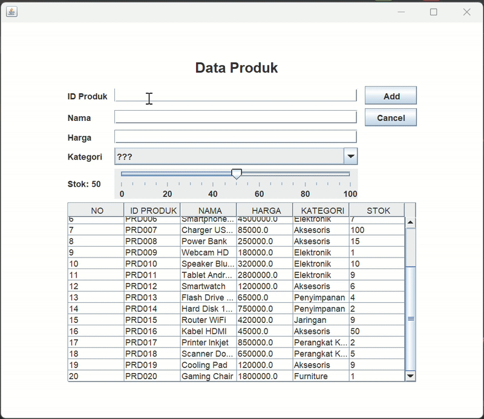

# TP5DPBO2425C2 
## JANJI
Saya Shakila Aulia dengan NIM 2403086 mengerjakan Tugas Praktikum 4 dalam mata kuliah Desain dan Pemograman Berorientasi Objek untuk keberkahanNya maka saya tidak melakukan kecurangan seperti yang telah dispesifikasikan. Aamiin

---
## Desain dan Alur Program
**Desain Program**

Program ini memiliki dua kelas yaitu Product dan ProductMenu, dimana:
1. Product
   Product mereresentasikan produk berisi atribut dan juga method, yaitu:
   
   Atribut umum:
   - id = kode unik produk (contoh: P001).
   - nama = nama produk (Laptop Asus, Roti Tawar, dll).
   - harga = harga produk (double).
   - kategori = kategori produk (Elektronik, Makanan, Minuman, dll).
   - stok = jumlah stok produk (integer, diatur lewat JSlider ini merupakan atribut tambahan).
   
   Method: getter & setter untuk tiap atribut.
   
3. ProductMenu
   Berfungsi sebagai GUI untuk menampilkan dan mengelola data produk.
   - Menampilkan daftar produk dalam bentuk JTable.
   - Ada form input (teks, comboBox kategori, slider stok).
   - Ada tombol Add, Update, Delete, Cancel.
   - Ada event handler (listener) untuk aksi tombol dan perubahan slider.
   - Mengatur tampilan label, comboBox, dan slider.

4. Dataase
   Berfungsi untuk menghuungkan ke database serta eksekusi query insert, update, delete.

**Alur Program**

Penjelasan Kode Flow dari program:
1. Saat program dijalankan, langsung koneksi ke databse.
2. Constructor ProductMenu memanggil setTable() mengambil semua data dari database (SELECT) data produk ditampilkan di JTable.
3. User bisa:
   - Menambah produk → isi form (id, nama, harga, kategori, stok) → klik Add → data baru masuk ke listProduct → tabel diperbarui (id tidak boleh sama).
   - Mengedit produk → pilih baris di tabel → data tampil di form → ubah → klik Update → data di listProduct berubah → tabel diperbarui (id tidak bisa di update).
   - Menghapus produk → pilih baris → klik Delete → muncul konfirmasi → jika yes, produk dihapus dari listProduct.
   - Membatalkan input → klik Cancel → form dikosongkan.
     
---
## DOKUMENTASI
**Tampilan Output**

